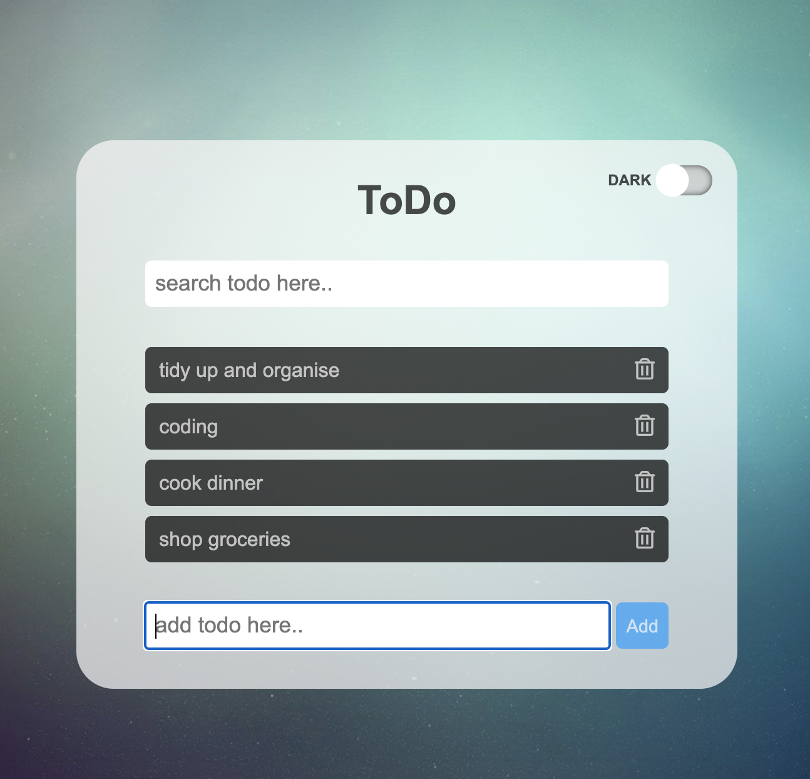
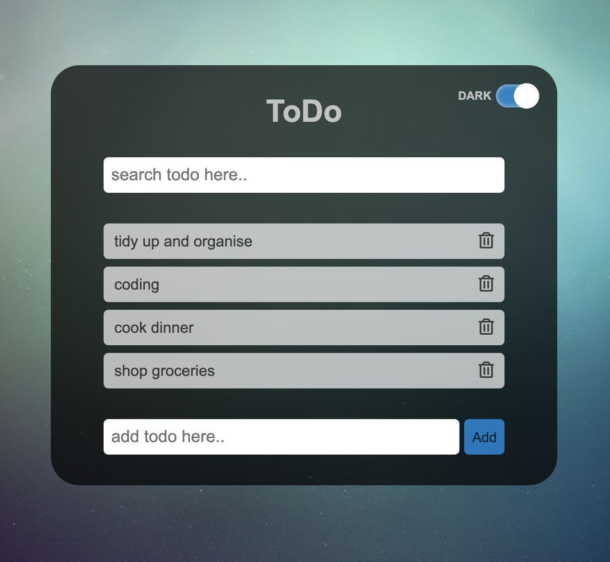

# pj__web-app__2-todo-app
## Info
- **Title**: Todo app
- **Author**: JM Woo
- **Link**: https://jayxwoo.github.io/pj__web-app__2-todo-app/
- **Log**: https://www.notion.so/2-Todo-app-no-database-ba2a337e936e42b28b480a79344258dd

## Features
- Add todo
- Delete todo
- Search todo
- Dark mode

## Skills
- HTML
- CSS
- JS
    - DOM manipulation
    - CSS style manipulation
    - class
    - filter() method
    - event listener

## Screenshots

